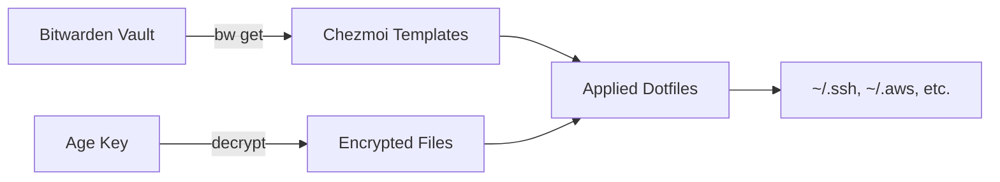

This dotfiles system uses a **three-layer architecture** that combines industry-standard tools to create a portable, secure, and maintainable configuration management solution.

## Architecture Overview

The system is built on three complementary layers:

<CardGroup cols={3}>
  <Card title="Chezmoi" icon="folder-tree">
    File management and templating layer
  </Card>
  <Card title="Ansible" icon="gears">
    System configuration and package management
  </Card>
  <Card title="Bitwarden + age" icon="lock">
    Secrets management and encryption
  </Card>
</CardGroup>

## Layer 1: Chezmoi (File Management)

**Role**: Manages dotfiles, handles templating, and orchestrates the other layers.

### Responsibilities

- **Source State Management**: Maintains the desired state of all configuration files in `~/.local/share/chezmoi/`
- **File Templating**: Generates personalized configs using Go templates
- **Encryption Integration**: Seamlessly encrypts/decrypts sensitive files using `age`
- **Secrets Integration**: Pulls secrets from Bitwarden CLI during file generation
- **Orchestration**: Triggers Ansible playbooks via `run_once_` scripts

### Key Features

<CodeGroup>
```toml .chezmoi.toml.tmpl
# Interactive prompts for machine customization
{{- $name := promptStringOnce . "name" "Your Name" "Julio Lira" -}}
{{- $machine_type := promptStringOnce . "machine_type" "Machine type (personal/work/hybrid)" "hybrid" -}}
{{- $editor := promptStringOnce . "editor" "Default Editor" "code" -}}

encryption = "age"

[data]
    name = {{ $name | quote }}
    machine_type = {{ $machine_type | quote }}
    editor = {{ $editor | quote }}

[age]
    identity = "~/.config/chezmoi/key.txt"
    recipient = {{ output "age-keygen" "-y" (joinPath .chezmoi.homeDir ".config/chezmoi/key.txt") | trim | quote }}
```
</CodeGroup>

<Note>
Chezmoi acts as the **entry point** for the entire system. Running `chezmoi init --apply` bootstraps everything.
</Note>

## Layer 2: Ansible (System Configuration)

**Role**: Automates system-level configuration that requires root privileges.

### Responsibilities

- **Package Installation**: Installs APT and Snap packages from centralized lists
- **Repository Management**: Adds external repositories with GPG key handling
- **System Hardening**: Configures passwordless sudo
- **Desktop Environment**: Sets GNOME preferences (dark mode, clock, power management)

### Data-Driven Approach

Instead of creating separate roles for each application, this system uses a **universal `common` role** that reads from centralized data files:

<CodeGroup>
```yaml ansible/group_vars/all.yml
external_repositories:
  - name: hashicorp
    key_url: https://apt.releases.hashicorp.com/gpg
    repo: "deb [arch=amd64 signed-by=/usr/share/keyrings/hashicorp-archive-keyring.gpg] https://apt.releases.hashicorp.com {{ ansible_facts['distribution_release'] }} main"
    keyring: /usr/share/keyrings/hashicorp-archive-keyring.gpg

workstation_packages:
  - terraform
  - git
  - htop
  - jq

snap_packages:
  - name: aws-cli
    classic: true
```

```yaml ansible/site.yml
---
- name: Configure System
  hosts: local
  connection: local
  become: true
  roles:
    - role: common
      tags: [common]
    - role: gnome
      tags: [gnome]
```
</CodeGroup>

<Tip>
To add new software, simply update `ansible/group_vars/all.yml` instead of creating new roles. The `common` role handles everything automatically.
</Tip>

### Integration with Chezmoi

Ansible is invoked automatically by chezmoi via a `run_once_` script:

```bash run_once_after_ansible.sh.tmpl
#!/bin/bash
echo "Running Ansible playbooks..."
cd {{ .chezmoi.sourceDir }}/ansible
ansible-playbook site.yml --ask-become-pass
```

## Layer 3: Secrets Management

**Role**: Secures sensitive data both in transit and at rest.

### Two-Pronged Security Model

<Steps>
  <Step title="Bitwarden CLI">
    **Runtime Secrets**: Pulls credentials on-demand during `chezmoi apply`
    
    - SSH private keys from Secure Notes
    - AWS credentials from Custom Fields
    - Age encryption key retrieval/backup
  </Step>
  
  <Step title="age Encryption">
    **At-Rest Encryption**: Protects files stored in the Git repository
    
    - SSH config files encrypted as `.age`
    - Symmetric encryption with a single identity key
    - Key stored at `~/.config/chezmoi/key.txt` (not committed)
  </Step>
</Steps>

### Secret Flow



<Warning>
The `age` private key itself is stored in Bitwarden as a Secure Note named `chezmoi-age-key`. Never commit this to version control.
</Warning>

## Component Interaction Flow

### Initial Bootstrap

<Steps>
  <Step title="Run bootstrap.sh">
    Installs dependencies: `ansible`, `age`, `bw`, `chezmoi`
  </Step>
  
  <Step title="Bitwarden Authentication">
    Logs into Bitwarden and unlocks the vault
  </Step>
  
  <Step title="Age Key Setup">
    Retrieves age key from Bitwarden or generates a new one
  </Step>
  
  <Step title="Chezmoi Init">
    User runs `chezmoi init --apply yurgenlira`
  </Step>
</Steps>

### Steady-State Apply

<Steps>
  <Step title="Chezmoi Reads Source">
    Processes templates and decrypts `.age` files
  </Step>
  
  <Step title="Bitwarden Queries">
    Fetches secrets using `bitwarden` and `bitwardenFields` template functions
  </Step>
  
  <Step title="File Application">
    Writes dotfiles to home directory
  </Step>
  
  <Step title="Ansible Execution">
    `run_once_after_ansible.sh.tmpl` triggers system configuration
  </Step>
  
  <Step title="System Configured">
    Packages installed, settings applied, environment ready
  </Step>
</Steps>

## Design Principles

<AccordionGroup>
  <Accordion title="Idempotency">
    Every operation can be run multiple times safely:
    - Ansible tasks use declarative state management
    - Chezmoi only applies changes when files differ
    - `run_once_` scripts include guard clauses
  </Accordion>
  
  <Accordion title="Portability">
    Works across different environments:
    - Standard Linux distributions (Ubuntu, Debian)
    - Windows Subsystem for Linux (WSL)
    - Hybrid work/personal machine configurations
  </Accordion>
  
  <Accordion title="Scalability">
    Easy to extend:
    - Data-driven Ansible approach avoids role proliferation
    - Centralized package lists in `group_vars/all.yml`
    - Template-based configuration generation
  </Accordion>
  
  <Accordion title="Security">
    Defense in depth:
    - Secrets never committed to Git
    - Age encryption for sensitive config files
    - Bitwarden for credential storage
    - Passwordless sudo configuration
  </Accordion>
</AccordionGroup>

## File Organization

```
dotfiles/
├── .chezmoi.toml.tmpl          # Chezmoi config with prompts
├── bootstrap.sh                 # One-shot setup script
├── run_once_after_ansible.sh.tmpl  # Triggers Ansible
├── ansible/
│   ├── site.yml                 # Main playbook
│   ├── group_vars/all.yml       # Centralized data
│   └── roles/
│       ├── common/              # Universal installer
│       └── gnome/               # Desktop settings
├── private_dot_ssh/             # SSH configs (age-encrypted)
└── dot_aws/                     # AWS configs (Bitwarden-sourced)
```

<Info>
Files prefixed with `private_` are automatically encrypted by chezmoi. The `dot_` prefix becomes `.` in the home directory.
</Info>

## Next Steps

<CardGroup cols={2}>
  <Card title="Chezmoi Deep Dive" icon="folder-open" href="/concepts/chezmoi">
    Learn about configuration and templating
  </Card>
  <Card title="Ansible Automation" icon="robot" href="/concepts/ansible">
    Understand the data-driven approach
  </Card>
  <Card title="Secrets Management" icon="key" href="/concepts/secrets">
    Explore Bitwarden and age integration
  </Card>
  <Card title="Quick Start" icon="rocket" href="/quickstart">
    Get your environment set up
  </Card>
</CardGroup>